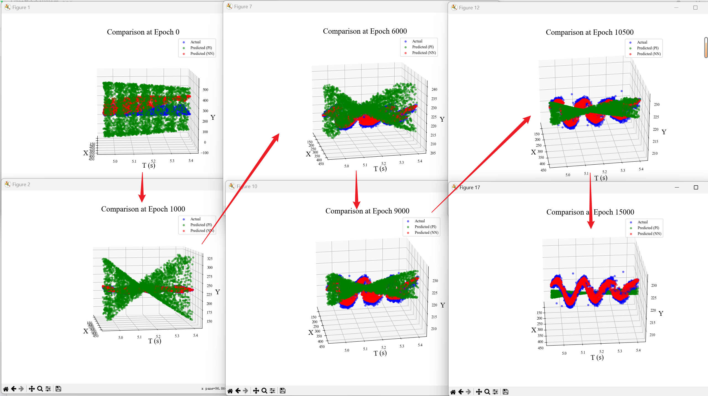
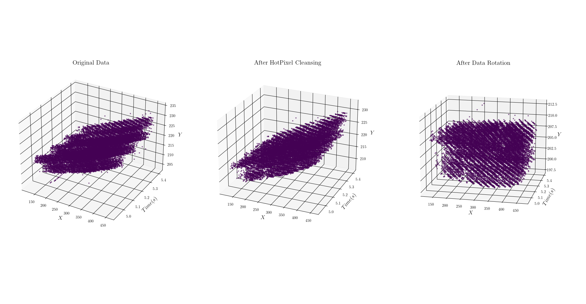
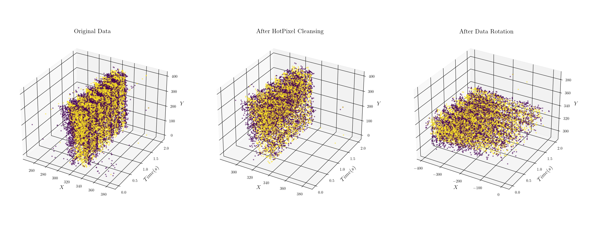

# 2024.2.28

## PINN-V.py released

功能更新

1. 完成了逆标准化的全过程修复
2. 修复了PINN-V.py中关于`PIloss`的计算错误
3. 重写了`rotate`函数，弃用了旋转矩阵的方式，直接对两坐标做计算并return，加快了运算速度
4. 添加了标准化函数`nomalize()`

优化更新

1. 添加了`Average time per epoch`
2. 添加了若干函数的注释与说明

---

# 2024.2.29

## PINN-V.py 修改

实验功能

1. 为了避免物理方程被拟合成平面，对a参数对逐渐减弱的扰动
2. 添加新的学习参数振幅`Y`，现在的物理方程公式为

$$
y = Y \cdot \sin (ax+b) \cdot \sin (\omega \sqrt{1 - \zeta ^2} t) \cdot e^{-\omega \zeta t}
$$

经过振幅增强发现



如图模型的优化过程，可以看到模型正确的选择了在开始振幅很大的时候选择通过降低振幅来减小Loss（注意到波形的频率很小，使得波数很少，就只有一个波节），并一直通过这种方式来降低Loss，但是同时也是因为波数少，使得在已经达到和原始数据差不多的振幅的时候，模型选择了继续扁平化来降低Loss，而不是提高波数，因为在模型看来从一个波节到原始数据的5-6个波节变化的过程中（目前认为是a增大）会使得Loss暂时地增大，所以模型不会选择增大波数而是选择继续降低振幅

- 但是仍然存在问题在于Y似乎没有被更新，有待进一步研究

---

# 2024.3.2

## PINN_ver2.0.py released

功能更新：

1. 整个文件重写，主要修改了物理方程为偏微分方程约束：

$$
EI \cdot \frac{\partial ^4 y}{\partial x ^4} - T \cdot \frac{\partial ^2 y}{\partial x ^2} + M \cdot \frac{\partial ^2 y}{\partial t^2} + c \cdot \frac{\partial y}{\partial t} = 0
$$

2. 重写了旋转函数，支持根据旋转轴进行旋转，通过关键字参数`axis`实现
3. 添加了`normalize`函数与`denormalize`函数，用于对数据进行标准化与反标准化
4. 删除了`net_u`函数，将其与`predict`函数功能合并
5. 增加了更加丰富的过程输出
   - 提供对于`准确性 Accuracy`的过程化输出
   - 分别对在训练集和验证集上的`loss_physical` `loss_nn` `Accuracy`进行输出
   - 提供每轮训练的耗时输出
6. 对过程出图的逻辑进行优化，使得不会一次生成太多图片
7. 为`Adam`优化器添加了L2正则化约束，添加`eps`防止梯度爆炸

优化更新：

1. 优化了`rotate`函数，使之更加快速
2. 优化了记录历史数据的方式，从动态增长修改为初始化后赋值，使之更加快速
3. 优化了散点图的样式，降低透明度
4. 优化了格式化输出的对齐

修复：

1. 修复了内存占用太大的问题
2. 修复了在绘图和过程评估中梯度丢失报错的问题

## dataChunk.py released

主要功能集成了`数据清洗`,`数据读取`,`数据切块`，`数据保存`等功能，并集成了可视化功能，使得更加方便地进行手动的对`aedat4`文件进行读取与切割、保存

---

# 2024.3.7

## PINN_ver2.1.py under advisement

问题发现：

1. 发现了一个ver2.0中的一个不合理的地方，会导致当数据整体为竖向的时候，模型的拟合效果大幅下降
2. 同时发现模型的拟合趋势和`gamma`的初始值关系很大，所以将`gamma`的初始值选定方案有待升级优化
3. 发现`rotate`函数的优化趋向，原来使用的使得`yEvent`的方差最小化的策略存在问题，在某些数据集下会导致拟合趋势有误
4. 修复了`rotate`函数中的一个重大逻辑问题，因为变量赋值后，新赋值的量马上被用到了下一个赋值中，这是错误的，我们本来应该实现：

$$
\begin{cases}
x = x \cdot \cos \theta + z \cdot \sin \theta \\
y = y \\
z = -x \cdot \sin \theta + z \cdot \cos \theta \\
\end{cases}
$$

但是我们使用了错误的赋值方式：

```python
x = x * torch.cos(theta) + z * torch.sin(theta)
y = y
z = -x * torch.sin(theta) + z * torch.cos(theta)
```

这是因为`x`在被赋值后马上被用到了下一个赋值`z`的赋值语句中

# 2024.3.9

## PINN_ver2.1.py under advisement

优化修复：

1. 修改了绘制各个变量的绘图代码，使之每个变量绘制在独立的子图中
2. 简单修改了输出的格式

功能更新：

1. 为总损失函数的各个损失函数前的系数配置为动态变化，动态变化采用了正态分布，通过调整`mu`和`sigma`来调整变化趋势与范围，使之在迭代的前中后期分别聚焦优化旋转角、神经网络拟合、物理方程拟合；其潜力有待进一步检查
2. 修改了神经网络拟合的方向，使之在旋转之后再做神经网络拟合，目前感觉应该更加正确，但是会导致拟合面为平面（原来在ver1.x中的问题重新出现）

---

# 2024.3.10

## PINN_ver2.1.py under advisement

发现关于PhysicalLoss函数的重大错误，原本是通过拟合的`y_pred`对`xEvent`和`Timestamp`等做求导，但是在拟合`y_pred`的时候使用`self.pred`函数输入错误，输入了未经过标准化的变量，这会导致预测完全错误。

尝试对其标准化的过程中，发现旋转变换：

$$
\begin{cases}
x_r = x \cdot \cos \theta + z \cdot \sin \theta \\
y_r = y \\
z_r = -x \cdot \sin \theta + z \cdot \cos \theta \\
\end{cases}
$$

直接如此显性地编写成代码，会使得后续进行求导`z_r`对`x_r`导数的时候梯度丢失，因为z_r与x_r本身之间不存在显性的直接关系，导致直接使用torch的自动微分系统求导错误

整体的错误是联系紧密的，系统的，代码还有较大的修改空间，目前下一步的修改方案为调整`gamma`不纳入学习参数，在数据预处理阶段直接对`xEvent`和`Timestamp`进行旋转变换

---

# 2024.3.12

## **Project Code Update！**

1. 重构项目代码
   本次对项目代码做出了很大的改动，主要所做的工作在于把原来单文件实现的代码拆分为多个子模块，实现一定的项目架构，架构如下：

```HTML
—PINN
|——data
|    |——aedat4（储存事件相机原始数据文件）
|    |——mat （储存一些已经转化为MATLAB矩阵格式的数据文件）
|    |——npy （储存由numpy保存的数据文件）
|——data_preprocessing ⚙️
|    |——__init__.py（库的必要文件）
|    |——data_cleansing.py（主要负责数据清洗，目前包括了HotPixel_cleansing函数）
|    |——plot_figure.py （画图代码，用于快速画图）
|    |——rotate.py （旋转变换，用于数据预处理）
|——Legacy（旧版的PINN代码）
|    ——EularEeq_0610.py
|    ——PINN_ver0.0.py
|    ——PINN_ver1.0.py
|    。。。
|——Photo（储存显示用图片）
|——venv（虚拟环境文件，不在代码仓库中）
|——.gitignore
|——main.py（主程序文件）
|——model.py（主模型文件）
|——README.md（本文档，说明用）
|——requirements.txt（环境配置说明文档）
```

2. 重写了PINN的主框架，移除了学习参数`gamma`，使得神经网络的结构得以简化，将旋转的操作利用线性回归的方式在PINN框架之外实现
3. 为旋转操作添加了函数`data_rotate`，用于数据处理阶段，将整个数据的分布转为横向，方便后续的操作。`data_rotate`函数支持多种线性回归的方式，包括：
   ```
   'polyfit' - Standard least squares polynomial fit using numpy's polyfit function.
   'RANSAC' - Robust regression analysis using sklearn's RANSACRegressor.
   'Huber' - Robust regression analysis using sklearn's HuberRegressor.
   'TLS' - Total least squares regression analysis.
   ```

最终实践证明，使用总体最小二乘法（Total Least Squares，TLS）在数据的倾斜程度很大的时候具有较好的效果，如图：

- 这是一个倾斜角较小的数据集，位置位于`./data/mat/test16-1.mat`
  
- 这是一个倾斜角比较大的数据集，位置位于`./data/npy.dvSave-2023_03_26_02_21_16.npy`
  

